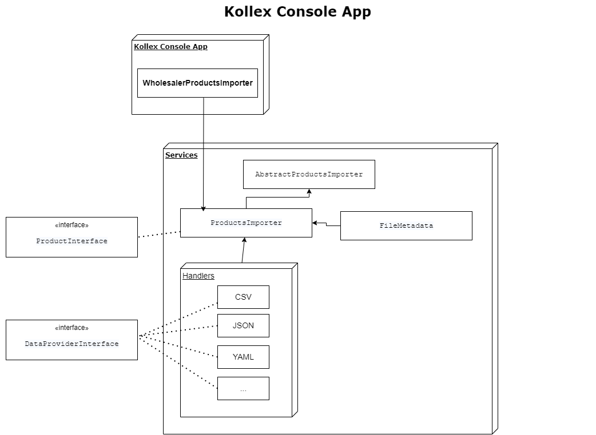

# kollex Coding Challenge – Wholesaler Integration

kollex digitalizes the traditional B2B wholesale by building a digital beverage ecosystem. With our platform gastronomy 
customers can order everything in a one-stop-shop from their associated wholesalers.

It's a decentralized concept, which implies, that kollex integrates with many wholesalers and gastronomy 
systems in all kind of ways and formats - from enterprise ERP systems to modern hypermedia APIs to classic CSV files. 

One of the essential information that is synced with the kollex platform to allow gastronomy customers ordering products 
from their associated wholesalers is the wholesaler's product assortment.


## Your Task
Your task is building a small piece of software, which is able to verify and interpret assortment and product 
information from different sources in different data formats. The amount of data and the exemplary "Product" schema 
is very simplified for the purpose of this coding challenge.

The challenge is to create a modern, maintainable, testable and extendable application, which:
- follows a pragmatic, but clean approach by 
  - building a smart software architecture 
  - e.g. utilizing the right design patterns without over-engineering
- follows best practices 
- can easily be extended to integrate additional sources or data formats
- is fully testable for continuous integration and delivery 


## The Data
In the `/data` folder, you find examples of assortment data in two different formats:
- wholsesaler_a.csv  
provides assortment data in CSV format
- wholsesaler_b.json  
provides assortment data in a JSON format


## The Goal
The goal is an application, which integrates different data formats (see "The Data") and maps those into the target
schema, which you can find in the `swagger.yaml`. This file does not describe a web API, but only defines 
the "Product" schema.

Your application should read the given data files (see "The Data") and return a JSON structure with a list of products 
as defined in the Swagger definition.

#### The Product Interface
The project provides the empty Interface `\Kollex\Assortment\ProductInterface`. Please implement this (based on the 
Product schema mentioned above) and/or all additionally required Interfaces or other types of Classes, which you think 
fit best for the given scenario.

#### Entrypoint
Your application **DOES NOT NEED** to expose a web API or a CLI interface. A simple PHP file as entrypoint is good 
enough. The focus of this task is the implementation of the data integration, validation and mapping.  


## What We expect
- using as few libraries as possible (testing libraries do not count)
- clean, well-structured code, that follows best practices
- tests. It's up to you which type of tests you want to write
- documentation of code, concepts or possible extensions in a way you think it fits best 


## Voluntary Tasks
- Docker setup: a Dockerfile and a docker-compose file, to run the whole stack via `docker-compose up`
- descriptions, why you chose a specific structure or pattern, framework or library compared to other options 
- a description of how you decided what tests to write

---

# Additional Info

## Tech Stack
- [PHP 8.1](https://www.php.net)
- [MySQL 8.0](https://www.mysql.com/)
- [Symfony CLI 4.28](https://symfony.com/)
- [PHPUnit 9.5](https://phpunit.de/)
- [Docker 20.10](https://www.docker.com/)
- [Docker Compose 1.29](https://docs.docker.com/compose/)

## What We expect
- using as few libraries as possible (testing libraries do not count)
  - [Symfony CLI 4.28](https://symfony.com/) and its few components, like:
    - `symfony/dependency-injection`
    - `symfony/test-pack`
- clean, well-structured code, that follows best practices
  - It was used a folder structure in order to separate classes according to its responsibilities.
  - Also, naming and code convention according to psrs
- tests. It's up to you which type of tests you want to write
  - It is used phpunit as unit library.
  - There is no integration / acceptance library installed. Codeception is not supporting yet php 8.1.
  - Please see folders in `tests`.
- documentation of code, concepts or possible extensions in a way you think it fits best
  - `documentation of code, concepts`: See sections below.
  - `possible extensions`: The application is open for extension. For this local application, it is important to be
    able to support more formats to be imported.  
    To accomplish it, just add a new handler class at `Kollex\App\Services\ProductsImporter` folder.
    All the mapping from a file to a model is done in each class handler for this file type. This is where it
    should be and facilitates maintenance.

## Voluntary Tasks
- Docker setup: a Dockerfile and a docker-compose file, to run the whole stack via `docker-compose up`.
  - Docker is in place.
  - The current status just covers the database service and it can be extended easily as usual in the
    `docker-compose.yml`file and its respective services in the `docker folder`.
- descriptions, why you chose a specific structure or pattern, framework or library compared to other options
  - The decision to use `Symfony` framework is due to Kollex uses it. In the end, any php framework which provides
    a DI container can be used, even php written from scratch can solve this problem.
  - The `Interpreter Pattern` was used as it delegates and behaves suitable for the situation for this code task,
    where the parse and loading data (process) is specific to each class. The `Interpreter Pattern` uses a class to
    represent each file type to be handle. Please see `Kollex\App\Services\ProductsImporter\AbstractProductsImporter`
    class.
- a description of how you decided what tests to write
  - It is impossible to have 100% of code coverage in a pratical sense. So, we need to decide what to test and what
    not to test.  
    We need to test what is critical or very relevant to the application. Given this fact, a crucial point in the
    application are the classes which handles each file type based on their file extension.  
    All of them are based on the `Kollex\App\Services\FileMetadata` class. A bug on it, will affect the system
    critically. So it is tested.
    There are another ones also very relevant to be tested, like the classes on `Kollex\App\Services\ProductsImporter`
    folder. Currently, they are not tested but in a real application, they must be.

## How to run it
- On the terminal, on the root folder, run:  
  `bin/console wholesaler-products-importer`
- Note: The current application is not fully implemented, just the key points on it and its architecture is given.

## Application
- After analysing the given problem and documentation
  - Some information needs to be 'renamed' for a meaningful domain and understanding.
  - Some information were not relevant and it was discarded:  
    For example, the fields which are not necessary they are not in the database and if they are provided in the files
    to be imported, they don't affect the system, they are just ignored.  
    Please see section 'Database' below for more information.

## Validations
- Please see section  `Processing files` below.

## Database
- The database used was mysql.
- It was created just 1 table so far. Of course, there will be related tables to be created in a real application.  
  For example, a table for storing the manufacturers details and warehouses as well. So, this main created table
  would be related to them.
- Below a sql of it:

```sql
CREATE TABLE `product` (
  `id` int unsigned NOT NULL AUTO_INCREMENT,
  `gtin_14` char(14) NOT NULL,
  `manufacturer_id_fk` bigint unsigned NOT NULL,
  `name` varchar(255) NOT NULL,
  `description` text,
  `package_container` enum('CA','BO','BX') NOT NULL COMMENT '''CA = case / BX = box / BO = bottle''',
  `package_item` enum('BO','CN') NOT NULL COMMENT '''BO = bottle / CN = can''',
  `package_metric` enum('GR','LT') NOT NULL COMMENT '''GR = grams / LT = liters''',
  `volume_amount` decimal(5,2) unsigned NOT NULL,
  PRIMARY KEY (`id`),
  UNIQUE KEY `gtin_14_UNIQUE` (`gtin_14`)
) ENGINE=InnoDB DEFAULT CHARSET=utf8mb4 COLLATE=utf8mb4_0900_ai_ci;
```

- Models / Repositories
  - Entities and Repositories were not created so far.

## Processing files
For the sake of simplicity, the current application tries to import straight away files available in some folder.
For a better and efficient way of importing files, it would be done in 2 steps:
1. Receiving a file (or files)
  - The files received needs to have a name convention, to avoid overwriting every day / time if they were not
    processed. A simple append of date / time on the file name is enough.
  - Before importing the file, we receive the file and needs to parse and validate it according to its
    structure definition.
  - In this phase, we can accept or reject the file, moving it to another folder according to the outcome of its
    initial validation.
2. Processing a file (or files)
  - After the initial phase, we are sure that at least, the file complies with its expected structure.
  - So, we can add business validations on it to perform (or not) the importing and moving the file to another folder
    according to its outcome.


## Overview

